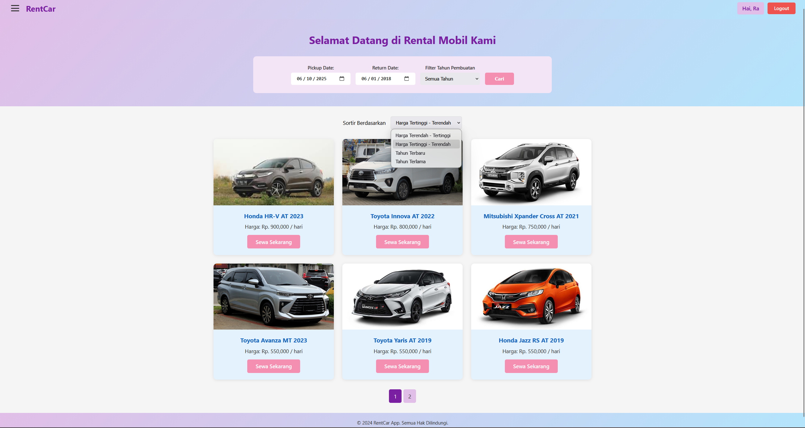
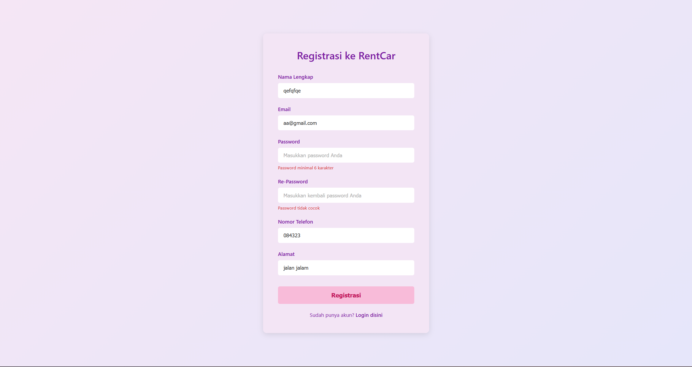
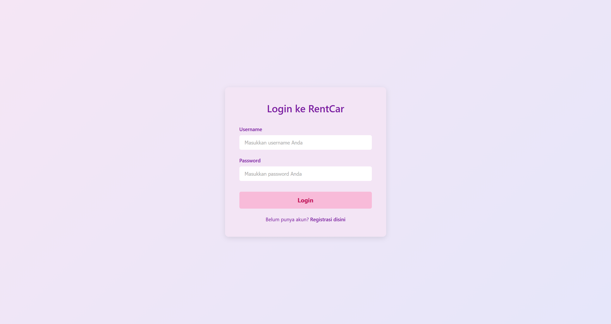
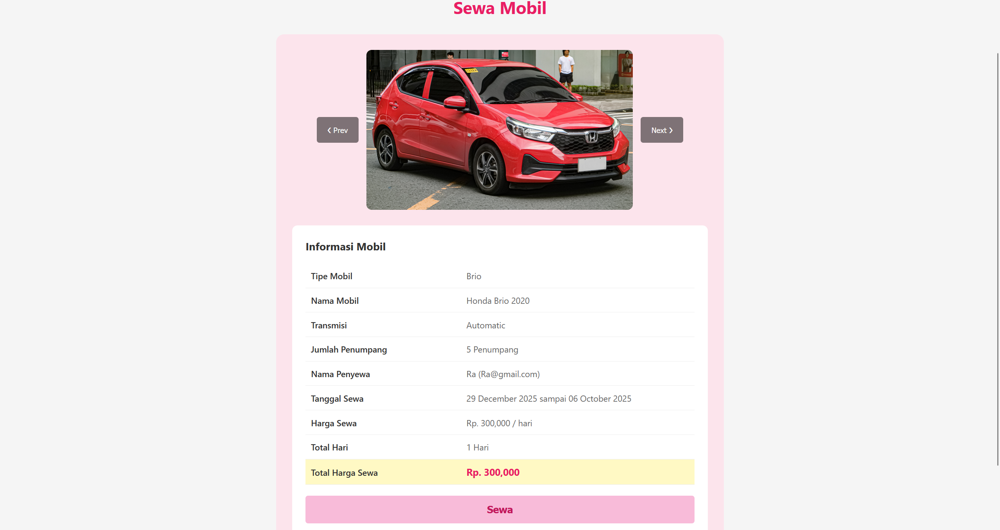
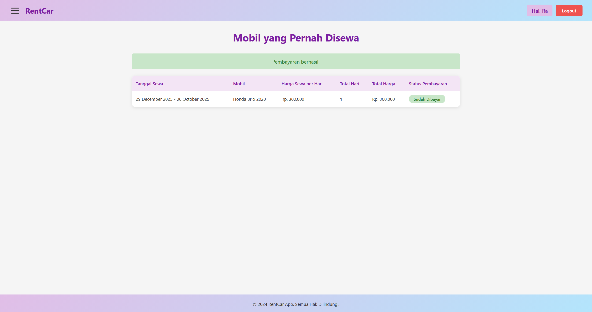
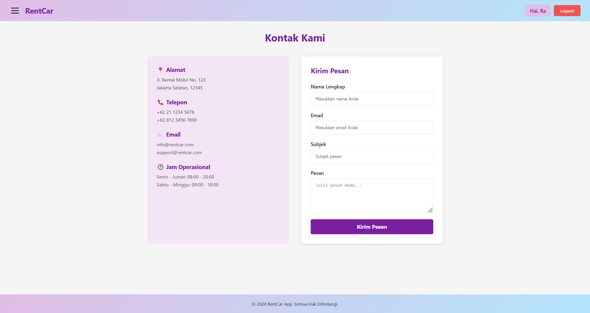

# 🚗 RentCar – Web Application (ASP.NET Core MVC)

RentCar adalah aplikasi web penyewaan mobil berbasis **ASP.NET Core MVC** yang dikembangkan sebagai **project individu**.  
Project ini mencakup sistem autentikasi, pencarian mobil, transaksi sewa, hingga manajemen pembayaran dengan **Entity Framework Core (Code-First)**.

---
## 📸 Screenshot Aplikasi

### Homepage & Pencarian Mobil

### Filter, Sorting & Pagination

### Registrasi dengan Validasi

### Login User

### Detail Mobil & Transaksi Sewa

### Riwayat Penyewaan & Pembayaran

### Halaman Kontak

## ✨ Fitur Utama

### 🔐 Sistem Autentikasi
- Register user dengan validasi (nama, email, password, no. telepon, alamat)
- Login menggunakan session management
- Logout

### 🏠 Homepage & Pencarian Mobil
- Pencarian mobil berdasarkan **Pickup Date** dan **Return Date**
- Filter mobil berdasarkan **tahun pembuatan**
- Menampilkan hanya mobil yang **tersedia pada periode tertentu**

### 🚘 Daftar Mobil
- Sorting:
  - Harga terendah → tertinggi
  - Tahun terbaru → terlama
- Pagination (6 mobil per halaman)
- Informasi mobil:
  - Gambar
  - Nama
  - Transmisi
  - Tahun
  - Harga per hari

### 💳 Transaksi Sewa Mobil
- Detail sewa lengkap:
  - Tipe mobil
  - Transmisi
  - Jumlah penumpang
  - Tanggal sewa
  - Total harga
- Perhitungan otomatis:
  - Total hari sewa
  - Total biaya
- Image slider untuk foto mobil

### 📜 Riwayat Penyewaan
- Riwayat transaksi per user
- Status pembayaran:
  - Belum Dibayar
  - Sudah Dibayar
- Pembayaran langsung dari halaman riwayat

### 🧭 Navigasi & UI
- Hamburger menu:
  - Home
  - Riwayat Penyewaan
  - Kontak Kami
- Navbar responsif
- Menampilkan nama user setelah login
- CSS murni (tanpa Bootstrap)

### 📞 Kontak Kami
- Informasi kontak perusahaan
- Form kirim pesan

---

## 🗄️ Database & Teknologi

### Database
- **Microsoft SQL Server**
- **Entity Framework Core 8**
- **Code-First Approach**

### Tabel Database
- `MsCustomer`
- `MsCar`
- `MsCarImages`
- `MsEmployee`
- `TrRental`
- `TrMaintenance`
- `LtPayment`

---

## ⚙️ Fitur Teknis Khusus
- Availability Check (mobil tidak muncul jika sedang disewa)
- Search & Filter dinamis
- Sorting & Pagination
- Payment tracking
- Session-based authentication

---

## 🧑‍💻 Teknologi yang Digunakan
- ASP.NET Core MVC
- C#
- Entity Framework Core 8
- Microsoft SQL Server
- HTML, CSS (tanpa framework)
- Git & GitHub

---

## 👤 Author
**Ricky Rudiansyah**  
Project Individu – Web Development (ASP.NET Core)
